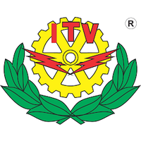
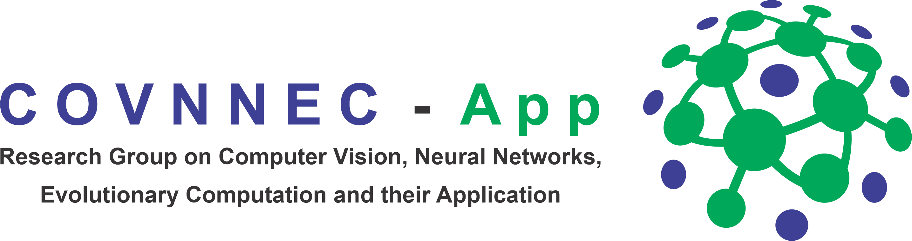

# **Taller de Aprendizaje Automático en Python**
Contenido del taller de Aprendizaje Automático en Python, del Coloquio de Divulgación de la Comunidad de Ingeniería en Sistemas (ColSis) del Instituto Tecnológico de Veracruz. 

           

## **Impartido por:**

* José Clemente Hernández Hernández  

* Gustavo Adolfo Vargas Hákim

Estudiantes de la Maestría en Inteligencia Artificial en el Instituto de Investigaciones en Inteligencia Artificial de la Universidad Veracruzana (IIIA-UV) y miembros del grupo de investigación COVNNEC-App (Computer Vision, Neural Networks, Evolutionary Computation and their Applications). 

## **Contenido del Taller**

### Día 1 - Introducción y procesamiento de datos en Python

1. ¿Qué es el Aprendizaje Automático?
2. Tipos de Aprendizaje Automático
3. ¿Cuáles son las partes del Aprendizaje Automático? ¿Qué es el *Knowledge Discovery in Databases (KDD)?
4. ¿Cuándo utilizar Aprendizaje Automático?
5. Numpy, Pandas y Matplotlib 
6. Discretización de datos
7. Aumentación de datos
8. Selección de características
9. Preprocesamiento de datos en Python 

### Día 2 - Aprendizaje Supervisado

1. Zoológico de algoritmos de Aprendizaje Automático
2. ¿Cuándo elegimos cuál algoritmo? Teorema del *No Free Lunch*
3. Algoritmo de Aprendizaje Supervisado
4. Métricas de evaluación
5. Validación cruzada
6. Algoritmo de K Vecinos más Cercanos (K-NN)
7. Algoritmo Ingenuo Bayesiano (Naïve-Bayes)
8. Algoritmo de Árbol de Decisión

### Día 3 - Aprendizaje No Supervisado y Aprendizaje por Refuerzo

1. Algoritmos de Aprendizaje No Supervisado
2. Algoritmo K-Medias (K-Means)
3. Algoritmos de Aprendizaje por Refuerzo
4. Algoritmo de Aprendizaje-Q (Q-Learning)

### Día 4 - Redes Neuronales y Aprendizaje Profundo

1. El Perceptrón
2. Redes Neuronales Multicapa y retropropagación
3. Red Neuronal Multicapa en Scikit-Learn
4. Redes Neuronales Recurrentes (RNN)
5. Redes Neuronales Convolucionales (CNN)
6. Red Neuronal Convolucional en PyTorch 
7. Autoencoders y GANs
8. Trabajo futuro y proyectos actuales
