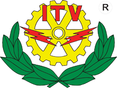

# Taller de Aprendizaje Automático en Python
Contenido del taller de Aprendizaje Automático en Python, del Coloquio de Divulgación de la Comunidad de Ingeniería en Sistemas (ColSis) del Instituto Tecnológico de Veracruz. 

  
